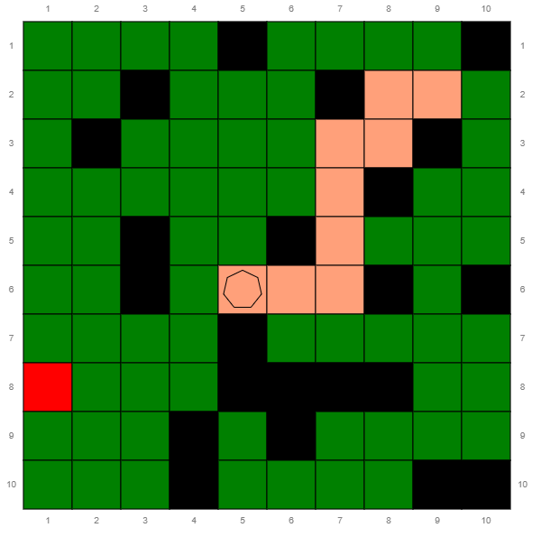

# Lab 2 - Intro to the Grid World

Hello! Welcome to Week 2 of Artificial Intelligence. The purpose of this lab is to introduce you to the Grid World where the remaining prolog labs will take place. This lab is **vitally** important for both coursework and exam students so please make sure that you complete it.

You will need to use a local swipl installation in order to run this code as SWISH **will not work**. You are also encouraged to use a text editor of your choice to edit the files (Both VSCode and Atom have support for prolog). If you have any trouble setting up swipl then please make a post in the megathread

You are provided with library code to host the webpage, make queries to wikipedia, as well as various other functions regarding the state of the game. This is all stored inside `/ailp` (standing for Artificial Intelligence with Logic Programming). 

You are also provided with 3 files of the form `lab_*_12345.pl`. This is where you will complete the exercises, and you will be pointed to the correct file for each section. Each of the files also has function stubs that you will need to implement for each of the exercises. The reason for the `12345` is because it will be replaced with *your* candidate number if you go on to do the coursework (alhough these labs aren't assessed so feel free to use whatever you want). 

**You do not need to look into the internals of the library** (although if you want to you can).

By the end of next week you will be able to do a more complex task, in a more complex grid world, as seen below. 

# Exercise 1: Geting Around

 For this exercise you will learn how to move around the grid world and how to create a spiral and ultimately create a spiral. The grid world is just the name of the environment that these labs will take part in. For this exercise you will be editing `lab_grid_12345.pl`.

## Possible Queries 

The following queries have been exported from the library code:

| Query Name                  | Description                               |
|-----------------------------|-------------------------------------------|
| start                       | Initiate the web server                   |
| shell                       | Open the command shell                    |
| my_agent(-A)                | Returns the ID of your Agent              |
| ailp_grid_size(-N)          | Returns the size of the grid              |
| get_agent_position(+A,-Pos) | Returns the position of Agent A           |
| agent_do_moves(+A,+L)       | Makes Agent A perform the list of moves L |

## How to run?

**THIS IS ONE OF THE MOST IMPORTANT SECTIONS**. In order to run the grid world, you need to open `ailp.pl` using swipl. This exercise is known as `lab grid` so we will pass that as a command line argument (e.g. `swipl ailp.pl lab grid`).
 
Upon loading you will likely see a lot of warnings
about singleton variables. this is normal and only because the functions in `lab_grid_12345.pl` have not been implemented. 

Next, Type in `start.` and hit enter to start the webserver. If you press anything but 'N'/'n', then the webpage will open automatically in your default browser. **Hit the run button on the webpage before you continue.**

We will use a shell to initialise the grid so type in `shell.` and then `setup.` in the following command prompt. (While the main prolog prompt is `?-`, in the shell it will look like `?`).

After the `setup/0` has finished, you can exit the shell using either `stop.`,`CTRL+D` or `CTRL+C` then (a)bort at the prompt.

## Identifying your Agent

At the top left of the grid, you will be able to see a coloured shape. This is your agent. For the first task in this exercise, you need to find a query that allows you to identify your agent and their current position and run it in the shell.

## Create predicate `m/1`

The first step of moving around the grid world is defining the directions that we are able to move. They are `n`,`e`,`s` and `w`. For the first part of this exercise, you will need to define the predicate `m(A)` such that it is true when `A` is a valid direction.

## Create predicate `on_board/1`

Next, We need to create the predicate `on_board(+P)` that tells us if a position `P` is on the board. Positions are stored as a compound term `p(X,Y)` where both X and Y range from 1 to the grid size inclusive.

TIP: You can use the predicate `ailp_grid_size/1` to find the size of the grid.

## Create predicate `pos_step/3`

For this step we need to find the new position after an agent has made a possible step (although we don't need to check the validity yet!). The full predicate is `pos_step(+Pos,+Dir,-NPos)`.

## Create predicate `new_pos/3`

We are now able to combine the previous steps together to find the new position after a move has been made as well as to check that the move is valid. `new_pos(+Pos,+M,-NPos)` should be true if moving from `Pos` in direction `M` will lead to `NPos` and `NPos` is on the board.

## Create predicate `complete/1`

The predicate `complete(+L)` should be true if the Length of `L` is equal to the number of cells in the grid. The size of the grid **SHOULD NOT** be hardcoded.

## Create predicate `spiral/1`

The final part of this exercise is to implement the predicate `spiral(-L)` which will move the agent from the start position `p(1,1)` towards the center of the grid in a spiral pattern. L should be the list of steps that are taken by the agent to reach the center **including** the start position (You can test this using `complete/1`) 

TIP: In order for the agent to actually move, you will need to use `agent_do_moves(A,L)` where A is the identifier of your Agent and L is a path **that does not include** your current position.
# Exercise 2: Identity Loss - Part 1

For the next exercise, you will need to use a wikipedia API to uncover the identity of an actor based only on links from their wikipedia page. You will need to edit `lab_identity_12345.pl`.

## Possible Queries

The following queries have been exported from the library code:

| Predicate				   						| Meaning                                                               				|
|-----------------------------------------------|---------------------------------------------------------------------------------------|
| `actor(-Actor)`								| return each possible secret actor identity  (e.g. `'Billy Bob Thornton'`)		|
| `wp(+Title,-WikiText)`					| connect to Wikipedia page with given Title and return its WikiText    				|
| `wp(+Title)`								| connect to Wikipedia page with given Title  and print its WikiText 					|
| `wt_link(+WikiText, -Link)`				| return any Link contained in the given WikiText										|
| `agent_ask_oracle(+A, +Orac,+Qu,-Ans)`| This is used to question the oracle. If the Agent's Question is `link` then the Oracle's Answer will be a random link from the Wikipedia page whose title is the (name of the) secret random actor identity |
| `test`										| test if `find_identity/1` successfully returns correct identity in all possible cases	|

## How to run?

Run using `swipl ./ailp.pl lab identity` 

The file `lab_identity_12345.pl` will automatically be consulted and should be the place that your work is done. There is no need to follow the steps to start the webserver this time as the grid world itself is not used.

## Experiment with the predicates

Before you start to find the secret identity it is a good idea to familiarise yourself with the predicates. Can you find a query that stores all the links from a wikipedia page of your choice in a list?

## Create predicate `find_links_by_actor/2`

It's now time to create a predicate that finds all the links on a given actors wikipedia page. This predicate will take the form of `find_links_by_actor(+Actor,-Links)`. 

# If you have made it this far then you are done for the week!